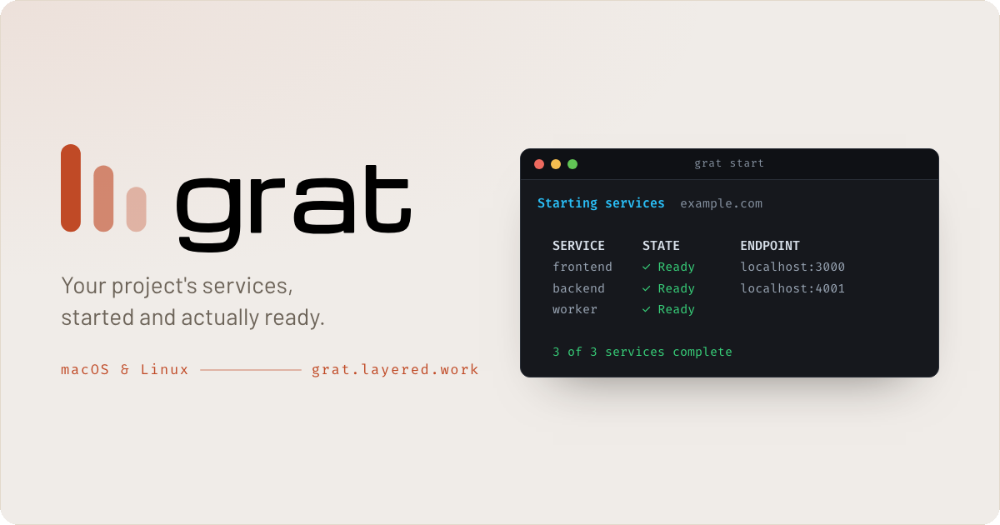

<p align="center">
  <a href="https://github.com/phranck/grat/actions/workflows/ci.yml"></a>
  <a href="https://github.com/phranck/grat/releases"></a>
  <a href="go.mod"></a>
  <a href="https://github.com/phranck/grat/releases"></a>
  <a href="LICENSE"></a>
  <a href="https://github.com/phranck/grat/commits/main"></a>
  <a href="https://github.com/phranck/grat"></a>
</p>

<p align="center">
  
</p>

# grat

`grat = grat runs approved tasks`

grat replaces the terminal tabs used to run a local development stack. Declare the commands for a frontend, an API, a dashboard, or a background worker once in `grat.config`, then manage them together.

```sh
grat discover  # reads the project and writes grat.config
grat start     # starts every service and waits until each one answers
grat status    # what runs, on which port, under which PID
grat stop
```

One project can start a React frontend, a Laravel or Vapor API, and a queue worker with one command. grat keeps their logs together, assigns ports by service role, checks that HTTP services are actually ready, and stops the complete process groups it started.

## Does grat fit your project?

grat manages long-running development commands on macOS and Linux. A configured command has to stay in the foreground and be one of two things:

- An HTTP service that takes a configurable local port and answers its health path with a status from 200 through 299.
- A worker that has no HTTP port and only has to stay alive, such as a queue consumer or a file watcher.

An HTTP service can also publish one path to the internet at an address that stays the same, which is what a webhook from a payment provider or any other server-to-server callback needs.

Each command runs from the project root through non-login `/bin/sh`, and receives its port in `PORT`. A command that puts itself in the background leaves nothing for grat to watch, and a service whose port is held by a separate daemon never becomes ready.

## Installation

On macOS, and on Linux where Homebrew is installed:

```sh
brew install phranck/grat/grat
```

That route installs the man pages as well, so `man grat` works straight away.

On Linux without Homebrew, take the release binary. It is one file and depends on nothing:

```sh
version=$(curl -fsSL https://api.github.com/repos/phranck/grat/releases/latest | sed -n 's/.*"tag_name": *"\([^"]*\)".*/\1/p')
curl -fsSL -o grat "https://github.com/phranck/grat/releases/download/$version/grat_${version}_linux_amd64"
chmod +x grat
sudo install -m 0755 grat /usr/local/bin/grat
```

The version is read from the newest release rather than written here, so this stays current. Use `linux_arm64` on ARM. macOS binaries are published the same way, as `darwin_amd64` and `darwin_arm64`. A binary installed this way carries no man pages; `grat.1` and `grat.config.7` sit beside it in the same release, and [Documentation.md](Documentation.md#installation) says where to put them.

Or build it with Go 1.25.13 or newer:

```sh
go install github.com/phranck/grat/cmd/grat@latest
```

[Documentation.md](Documentation.md#installation) covers verifying a release binary against its checksums and its signed attestation.

## Quick start

Run the setup in a project directory:

```sh
cd ~/Developer/example
grat discover
grat start
grat status
```

`grat discover` reads the project and proposes the services it recognises, so most projects need nothing written by hand. Angular, Astro, Next.js, Nuxt, React Router, SvelteKit and Vite are recognised on the frontend, Django, Laravel, Rails and FastAPI on the backend, along with Go modules and Swift packages using Vapor.

Express, Fastify, NestJS and Go are different: none of them reads `PORT` on its own and none has a flag for it, so the port lives in the line of your own code that starts the server. grat looks there, and where it does not find it, it says so instead of proposing a command that would never become ready. [What grat recognises](Documentation.md#how-grat-decides-what-a-project-runs) explains why.

Anything grat does not propose can be given explicitly:

```sh
grat discover --name example-api \
  --service 'backend=swift run App serve --hostname 127.0.0.1 --port $PORT'
```

The resulting `grat.config` is regular TOML and can be read and edited before the first start.

Given a path, `grat discover` searches below it instead and shows what it found as a list you move through, so a folder of twenty projects is set up in one pass and you decide per project whether its configuration is written:

```sh
grat discover ~/Developer
```

## Reading further

- **`man grat`** for every command and how grat works, and **`man grat.config`** for every option the configuration file takes. Both are generated by the binary, so they describe the version you have. `grat help` prints a short overview of the commands without leaving the terminal.
- **[Documentation.md](Documentation.md)** for the configuration reference, the roles and their port ranges, what readiness and shutdown guarantee, and how public access works.
- **[grat.layered.work](https://grat.layered.work)** for the overview.

## Contributing and support

Read [CONTRIBUTING.md](CONTRIBUTING.md), [SECURITY.md](SECURITY.md), [CODE_OF_CONDUCT.md](CODE_OF_CONDUCT.md), and [SUPPORT.md](SUPPORT.md) before participating.

## License

grat is licensed under the [MIT License](https://layered.mit-license.org).
